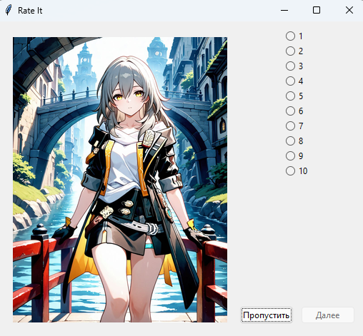
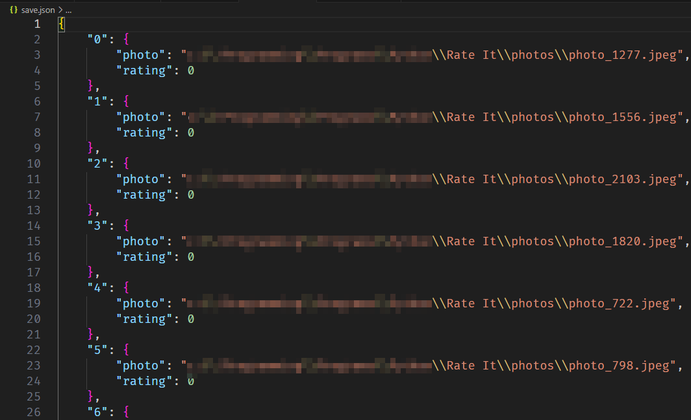

# Rate It
## Цель программы
Rate It помогает быстрее оценивать фотографии из заданного пула, которые расположены в папке **photos**

## Работа программы
При первом запуске Rate It создаёт файл `save.json` в коренной папке. В нём в случайном порядке хранятся все фото, которые на момент запуска программы находились в папке **photos**, а также оценка пользователя для этих фото *(по умолчанию оценка 0)*

Пример работы программы:

Пример файла сохранения:

## Сочетания клавиш
1. Клавиши `1-9` соответствуют идентичным оценкам. Клавиша `0` идентична оценке 10
2. Клавиша `Enter` нажимает кнопку "Далее"
3. Клавиша `Space` нажимает кнопку "Пропустить"
